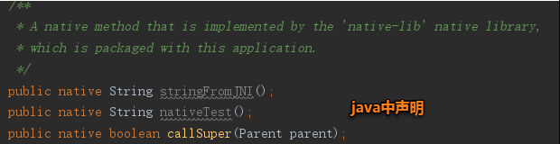
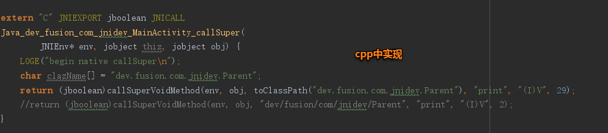
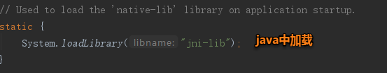
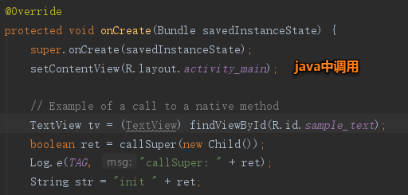

# JNIProject

## Cmake语法

### cmake版本 cmake中不区分大小写
cmake_minimum_required(VERSION 3.10.2)

### 声明并命名项目.
project("jniproject")

### 创建一个库 可以多次调用创建多个库
add_library( jniproject
SHARED
native-lib.cpp ) 
+ 1.第一个参数:设置库的名称.
+ 2.第二个参数:设置库的类型 SHARED(共享库) or STATIC(静态库)
+ 3.第三个参数:设置生成库的源文件

### 搜索指定的预构建库（CMake默认包含系统库）
find_library(
log-lib
log)
+ 1.设置路径变量的名称
+ 2.指定要CMake查找的NDK库的名称.

#### 指定目标链接库
target_link_libraries( 
jniproject
${log-lib} )
+ 1.指定目标库.
+ 2.将目标库链接到日志库包含在NDK中

## JNI

### JNI的开发流程
#### JNI开发姚经理一下4个步骤
+ 1.在Java中声明

+ 2.在CPP中实现声明

+ 3.在java中加载该so库
    

+ 4.在java中调用该so库中的方法

